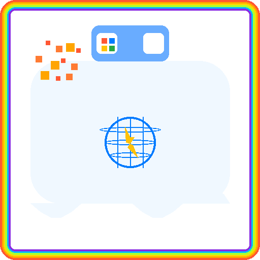

<!-- Darbot Windows MCP – README -->

> **⚠️ IMPORTANT DISCLAIMER**  
> This software enables you to build computer use agents that can control your Windows desktop programmatically. By using this software, you accept full responsibility for any actions performed by AI agents or automated systems built with this tool. This is open-source software provided without warranty, support, or liability. Use at your own risk and ensure you understand the implications of automated desktop control.

<div align="center">

  
  
  <h1>🪟 Darbot Windows MCP</h1>

  <a href="https://github.com/darbotlabs/Darbot-Windows-MCP/blob/main/LICENSE">
    
  </a>
  
  
  
  <br>

</div>

---

Darbot Windows MCP is part of the extensible Darbot Framework, an open-source **Model Context Protocol (MCP)** server that lets any MCP-aware client (VS Code agent-mode, Claude Desktop, Gemini CLI, custom LLM agents, etc.) control Windows just like a human.

This enhanced version builds upon the foundational work of [Windows-MCP](https://github.com/CursorTouch/Windows-MCP), adding comprehensive NPM packaging, dual installation methods, professional documentation, and enhanced tooling.

It exposes 15 tools that cover everyday desktop automation—launching apps, clicking, typing, scrolling, getting UI state, and more—while hiding all the Windows Accessibility and input-synthesis complexity behind a simple HTTP/stdio interface.

## 📋 Table of Contents

- [✨ Key Features](#-key-features)
- [🖥️ Supported OS](#️-supported-os)
- [📸 Screenshots](#-screenshots)
- [🛠️ Available Tools](#️-available-tools)
- [⚡ Quick Start](#-quick-start)
- [📦 Prerequisites](#-prerequisites)
- [🎯 Usage Examples](#-usage-examples)
- [🗜️ Other Clients](#️-other-clients)
- [🚧 Troubleshooting](#-troubleshooting)
- [🚧 Limitations](#-limitations)
- [🤝 Contributing](#-contributing)
- [📚 Additional Documentation](#-additional-documentation)
- [🪪 License](#-license)

### 🆕 Recent Improvements

• **NPM Package Available** – Install globally with `npm install -g darbot-windows-mcp`  
• **Dual Setup Options** – Choose between UV (modern, fast) or standard Python (traditional pip/venv)  
• **Enhanced Documentation** – Complete setup guides for both installation methods  
• **Fixed VS Code Integration** – Corrected MCP configuration for seamless VS Code agent mode  
• **Comprehensive Testing** – All 15 tools validated and working perfectly  
• **Better Error Handling** – Improved troubleshooting guide with common solutions  
• **Documentation Consolidation** – Organized comprehensive documentation for all user needs

---

## ✨ Key Features

• **One-Command Installation** – `npm install -g darbot-windows-mcp && darbot-setup`  
• **Dual Installation Options** – Use modern UV or traditional Python/pip workflows  
• **Native Windows integration** – Uses UI Automation, Win32 APIs, and pyautogui for reliable control  
• **Zero CV / Vision optional** – Works with *any* LLM; screenshot attachment is optional  
• **Fast** – Typical end-to-end latency 1.5 – 2.3 s per action  
• **MCP-compliant** – Validates against the official JSON schema; ready for VS Code, Claude, Gemini CLI  
• **Extensible** – Add your own Python tools in `main.py`  
• **MIT-licensed** – Fork, embed, or commercialize freely

---

## 🖥️ Supported OS

• Windows 11

---

## 📸 Screenshots

<div align="center">


*Darbot Windows MCP in action with VS Code, desktop automation, and MCP tools*

</div>

---

## 🛠️ Available Tools

| Tool | Purpose |
|------|---------|
| Launch-Tool | Launch an application from the Start menu. |
| Browser-Tool | Launch Microsoft Edge browser and navigate to a specified URL. |
| Powershell-Tool | Run a PowerShell command and capture output. |
| State-Tool | Dump active app, open apps, interactive / informative / scrollable elements, plus optional screenshot. |
| Clipboard-Tool | Copy text to clipboard or paste current clipboard contents. |
| Click-Tool | Click at `(x, y)` with configurable button/clicks. |
| Type-Tool | Type text into the UI with optional clear. |
| Switch-Tool | Bring a window (e.g., "notepad") to the foreground. |
| Scroll-Tool | Vertical / horizontal scrolling at coordinates. |
| Drag-Tool | Drag from `(x₁, y₁)` to `(x₂, y₂)`. |
| Move-Tool | Move mouse cursor. |
| Shortcut-Tool | Send keyboard shortcut list (e.g., `["win","r"]`). |
| Key-Tool | Press single key (Enter, Esc, F1–F12, arrows, etc.). |
| Wait-Tool | Sleep for N seconds. |
| Scrape-Tool | Fetch a webpage and return Markdown. |

---

## ⚡ Quick Start

### Option A: NPM Global Installation (Recommended) 🚀

**The fastest way to get started with Darbot Windows MCP:**

```bash
# Install globally via NPM
npm install -g @darbotlabs/darbot-windows-mcp

# Run the setup wizard (automatically configures VS Code + Claude Desktop)
darbot-setup

# Or start the MCP server directly
darbot-windows-mcp
```

**What the setup wizard does:**

- ✅ Installs Python dependencies via UV or pip
- ✅ Configures VS Code MCP integration  
- ✅ Configures Claude Desktop integration
- ✅ Tests the installation
- ✅ Provides next steps

### Option B: Manual Installation via UV

**For developers who prefer direct control:**

1. **Install UV package manager:**
   
   ```bash
   # On Windows PowerShell
   powershell -ExecutionPolicy ByPass -c "irm https://astral.sh/uv/install.ps1 | iex"
   ```

2. **Clone and install:**

   ```bash
   git clone https://github.com/darbotlabs/darbot-windows-mcp.git
   cd darbot-windows-mcp
   uv sync
   ```

3. **Configure VS Code MCP integration:**

   Create/update `.vscode/mcp.json` in your workspace root:
   
   ```json
   {
     "servers": {
       "darbot-windows-mcp": {
         "type": "stdio",
         "command": "uv",
         "args": [
           "--directory",
           "${workspaceFolder}/darbot-windows-mcp",
           "run",
           "main.py"
         ]
       }
     }
   }
   ```

4. **Configure VS Code settings:**

   Create/update `.vscode/settings.json` in your workspace root:
   
   ```json
   {
     "mcp.servers": {
       "darbot-windows-mcp": {
         "command": "uv",
         "args": [
           "--directory", 
           "${workspaceFolder}/darbot-windows-mcp",
           "run",
           "main.py"
         ],
         "env": {}
       }
     }
   }
   ```

### Option C: Manual Installation via Python/Pip

**Traditional Python environment setup:**

1. **Prerequisites:** Ensure Python 3.12+ is installed

2. **Clone and install dependencies:**

   ```bash
   git clone https://github.com/darbotlabs/darbot-windows-mcp.git
   cd darbot-windows-mcp
   
   # Create virtual environment
   python -m venv venv
   venv\Scripts\activate
   
   # Install dependencies
   python -m pip install -r requirements.txt
   ```

3. **Configure VS Code MCP integration:**

   Create/update `.vscode/mcp.json` in your workspace root:
   
   ```json
   {
     "servers": {
       "darbot-windows-mcp": {
         "type": "stdio",
         "command": "python",
         "args": [
           "${workspaceFolder}/darbot-windows-mcp/main.py"
         ],
         "cwd": "${workspaceFolder}/darbot-windows-mcp"
       }
     }
   }
   ```

4. **Configure VS Code settings:**

   Create/update `.vscode/settings.json` in your workspace root:
   
   ```json
   {
     "mcp.servers": {
       "darbot-windows-mcp": {
         "command": "python",
         "args": [
           "${workspaceFolder}/darbot-windows-mcp/main.py"
         ],
         "cwd": "${workspaceFolder}/darbot-windows-mcp",
         "env": {}
       }
     }
   }
   ```

**After any installation method:**

1. **Restart VS Code** to load the MCP server
2. **Test the tools** in VS Code agent mode
3. **Start automating!** 🚀

---

## 🗜️ Other Clients

• **Claude Desktop** – Build `.dxt` then load in *Settings → Extensions*.  
• **Gemini CLI** – Add `darbot-windows-mcp` entry in `%USERPROFILE%/.gemini/settings.json`.  
• Any HTTP or stdio MCP client.

---

## 📦 Prerequisites

• **Node.js 16+** - For the npm installation method  
• **Python 3.13+** - Required for the MCP server  
• **Windows 11** - Primary supported platform (Windows 10 may work)  
• **English Windows locale** - For consistent UI Automation tree

---

## 🚧 Troubleshooting

### NPM Installation Issues

If the npm installation fails:

```shell
# Clear npm cache and try again
npm cache clean --force
npm install -g darbot-windows-mcp --force

# Or install from source
git clone https://github.com/darbotlabs/Darbot-Windows-MCP.git
cd Darbot-Windows-MCP
npm install
npm link
```

### Error: "No module named uv"

If you see this error:

```text
C:\Users\[username]\AppData\Local\Programs\Python\Python312\python.exe: No module named uv
```

This means `uv` is not installed. You have two options:

**Option 1:** Install UV and use the faster dependency management:

```shell
python -m pip install uv
```

**Option 2:** Use standard Python instead (see "Option C: Using Standard Python" above)

Or use the standalone UV installer:

```shell
# On Windows
powershell -ExecutionPolicy ByPass -c "irm https://astral.sh/uv/install.ps1 | iex"
```

After installation, restart VS Code and try again.

### MCP Server Connection Issues

If VS Code shows connection errors, ensure:

1. **Dependencies are installed** - Run `uv sync` or `pip install -r requirements.txt`
2. **Python version is 3.13+** - Check with `python --version`
3. **VS Code is restarted** after configuration changes
4. **Correct workspace folder path** in the configuration files

### Testing the Installation

You can test if the server works by running:

```shell
# With UV
uv run python main.py --help

# With standard Python  
python main.py --help

# With npm package
darbot-windows-mcp --help
```

All should show the MCP server information without errors.

---

## 🎯 Usage Examples

Once set up, you can use any of the 15 tools through VS Code's agent mode or other MCP clients:

```javascript
// Example interactions through MCP:
"Launch notepad"           → Launch-Tool opens Notepad
"Click at 400, 300"        → Click-Tool performs mouse click
"Type 'Hello World'"       → Type-Tool enters text
"Open google.com"          → Browser-Tool launches Edge with URL
"Copy this text"           → Clipboard-Tool manages clipboard
"Press Ctrl+S"             → Shortcut-Tool sends key combination
"Get desktop state"        → State-Tool shows current UI elements
"Run dir command"          → Powershell-Tool executes commands
```

All tools work seamlessly with AI agents, providing full Windows desktop control through natural language commands!

---

## 🚧 Limitations

• Fine-grained text selection is pending.  
• `Type-Tool` types whole blocks; not optimised for coding heavy files.

---

## 📚 Additional Documentation

For more detailed information, see our comprehensive documentation:

- **[📋 Installation Guide](INSTALLATION.md)** - Detailed setup instructions for all installation methods
- **[🛠️ Tools Reference](TOOLS.md)** - Complete documentation of all 15 available tools with examples
- **[🚧 Troubleshooting Guide](TROUBLESHOOTING.md)** - Common issues and solutions
- **[👨‍💻 Development Guide](DEVELOPMENT.md)** - Contributing, adding tools, and development workflow
- **[🤝 Contributing Guidelines](CONTRIBUTING.md)** - How to contribute to the project

---

## 🤝 Contributing

Pull requests and issues welcome! See [CONTRIBUTING.md](CONTRIBUTING.md) and [DEVELOPMENT.md](DEVELOPMENT.md) for detailed guidelines.

---

## 🪪 License

MIT – © 2025 Darbot at Darbot Labs / contributors

### Attribution

This project is based on and extends the original [Windows-MCP](https://github.com/CursorTouch/Windows-MCP) repository by CursorTouch. We acknowledge and thank the original contributors for their foundational work in Windows desktop automation through the Model Context Protocol.

**Original Repository:** [Windows-MCP](https://github.com/CursorTouch/Windows-MCP)  
**Enhancements by Darbot Labs:** NPM packaging, dual installation methods, enhanced documentation, professional branding, setup wizards, and comprehensive testing.
